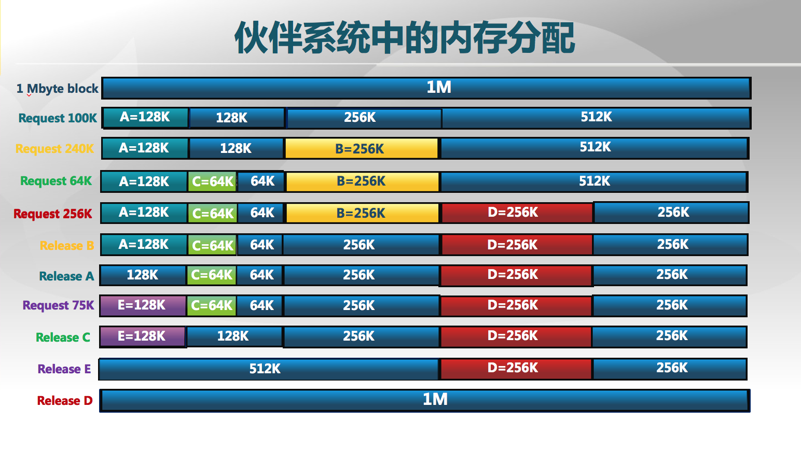

# Buddy_System

## 简介

我们实现了一个基于线段树的Buddy_System，模拟了一块内存的申请和释放(没有真的从内存中申请那一块)，我们把它封装成一个类，我们提供如下几个接口:init_buddy, traverse, malloc, free。

+ void init_buddy(buddy_node* node, int l, int r)

传入一个树的根节点，以及起始地址l(left)和终止地址r(right)，可以支持地址不是从0开始的连续地址(只需要满足一定的条件)。
使用这组参数来初始化我们的线段树。

+ void traverse(buddy_node* node)

遍历线段树，输出所有已使用的块和空闲块。格式为：（起始地址，结束地址，类型）

+ int malloc(int size)

申请一块大小为size的空间，实际上我们会分配一块可能稍大的2的幂的块。返回它的首地址。

+ void free(int addr)

释放以addr开始的那块地址(我们会自动找到那块被申请的块)，如果addr不合法或者不是从我们这里申请的地址，那么会返回一个错误。

## 类型检查和错误处理

我们会在接口对输入进行检查。malloc的时候会自动转成2的幂，而free的时候会先检查起始地址是不是最小块的倍数，如果
不是最小块的倍数，会返回错误信息。如果free的时候发现没有以那个地址开始的并且被申请的块，我们也会返回一个错误。

##测试用例
测试用例是基于学堂在线视频5.5节中的样例来实现的

我们为伙伴系统初始了1M的空间，分配粒度为64KB（这样视觉效果更清晰一些），程序在初始状态输出了一次内存信息，在Request256K（第四次操作时）输出了一次内存信息，以及最后释放完毕输出了一次。输出格式为内存块的起始和终点地址以及是否被占用，可以和截图进行对比，发现是温吻合的。
